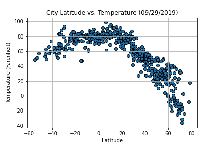

# pandas-weather-analysis

Author:  Erin James Wills, ejw.data@gmail.com  

<cite>Photo by [Greg Rosenke](https://unsplash.com/@greg_rosenke?utm_source=unsplash&utm_medium=referral&utm_content=creditCopyText) on [Unsplash](https://unsplash.com/s/photos/earth?utm_source=unsplash&utm_medium=referral&utm_content=creditCopyText)</cite>  

 

## Overview  

Analysis of humidity, temperature, cloudiness, and precipation data from over 1000 randomly selected cities from around the world.  Randomly selected cities were obtained by using the citipy package and weather data for each city was obtained from API calls to OpenWeather.  Analysis was performed by using Pandas and Matplotlib.

 

## Technologies    
*  Python
*  Pandas
*  Matplotlib

 

## Data Source  
Dataset generated within the notebook.  The cities used in this analysis were randomly generated by using the `citypy` package.  The weather data was generated by using the  [OpenWeather API](https://openweathermap.org/api). A free API key is needed to use this service.

 

## Setup and Installation  
1. Environment needs the following:  
    *  Python 3.6+  
    *  pandas  
    *  matplotlib.pyplot
    *  numpy
    *  requests
    *  time
    *  citipy
1. Activate your environment
1. Clone the repo to your local machine
1. Obtain a free API key from [OpenWeatherMap](https://openweathermap.org/appid#signup) by creating an account.
1.  Add the key to `config.py`.  Ensure that quotes are not deleted in this file.  The API key is used as a string.  
1. Start Jupyter Notebook within the environment from the repo
1. Run `WeatherPy.ipynb` 
1. **`Note:`** If the notebook says it can not find the file for the API Key then ensure you have entered your api key in config.py and have **saved the file**.  Next, restart the kernel and retry.  

 

## Analysis  

**`Note:`** Additional images can be found in the `output_data` folder.  Each time the notebook is run in it's entirety, the images are replaced with updated images.  

1.  The distribution of temperatures by latitude makes a somewhat symetrical distribution.  This makes sense since the northern and southern hemispheres are on opposite seasons.  

1.  The warmest regions should be between 20 to -20 degrees latitude year round since this is where the sun rays have the shortest path (based on the time of year/tilt of the earth).  Everything is shifted right because we are at the end of the summer period.  

1.  Other trends are difficult to discern; wind speed might be higher in the northern hemisphere and this could be due to the higher temperature and the wind is generated based on temperature/evaporation rates.  Cloudiness seems to be much more likely to be 0 or 100% than the other options.  Humidity seems to be influenced by temperature as expected.  

1.  Below is an example image generated from the notebook.

<figure>

  
<figcaption>Fig.1 - Scatter Plot showing Temperature versus Latitude
</figcaption>
</figure>  

**`Note:`** I should update the chart title to be dynamic and insert the date of when the chart was generated.  I realized recently that it is hard coded.